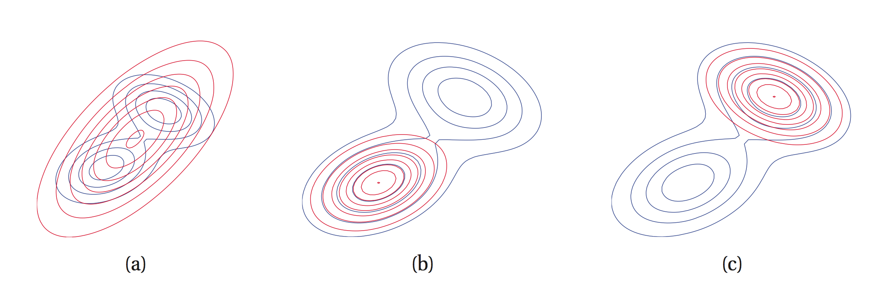

# Variational Inference

As apposed to [[sampling methods]] Variational Inference formulates inference as an optimisation problem. Sampling-based methods have several important shortcomings:

- Although they are guaranteed to find a globally optimal solution given enough time, its difficult to quantify how close they are to a good solution in practice.
- In order to quickly reach a good solution, MCMC methods require choosing an appropriate sampling technique (i.e [[Metropolis Hastings]]). Choosing this technique can prove very difficult.

## Inference as Optimisation

The main idea of variational inference is to cast inference as a optimisation problem. 

Suppose we are given an intractable probability distribution $p$. Variational techniques try to solve an optimisation problem over a class of tractable distributions $\mathcal{Q}$  to find a $q \in \mathcal{Q}$ that is most similar to $p$. We then query $q$ in order to get an approximate solution. 

Main differences between sampling & variational techniques:

- Unlike sampling methods, variational approaches will almost never find the globally optimal solution. 
- We will always know if they have converged, and even have bounds on the accuracy.
- Variational methods can often scale better in practice.

## The Kullback-Leibler Divergence

To formulate inference as an optimisation problem, we need to choose an approximating family $\mathcal{Q}$ and an optimisation objective $J(q)$. This objective needs to capture the similarity between $q$ and $p$ and the [[Kullback Leibler Divergence]] is a tool for this.

Formally the KL divergence between two distributions $q$ and $p$ with discrete support is:

$$KL(q||p) = \sum_{x}{q(x)\log{\frac{q(x)}{p(x)}}}$$
- $KL(q||p) \geq 0 \quad \forall q,p$
- $KL(q||p) = 0 \quad \Leftrightarrow q=p$

NB: $KL(q||p) \neq KL(p||q)$

## The Variational Lower Bound

Now how do we perform variational inference with KL divergence. We firstly fix a form for p. We'll assume that p is a general (discrete) undirected model of the form:

$$p(x_1, \dots, x_n; \theta) = \frac{\tilde{p}(x_1, \dots, x_n; \theta)}{Z(\theta)} = \frac{1}{Z(\theta)}\prod_k \phi_k(x_k;\theta)$$

Where $\phi_k$ are the factors and $Z(\theta)$ the normalising constant. The formalisation captures all the distributions such as marginal distributions of directed models $p(x|e)=\frac{p(x,e)}{p(e)}$ with evidence $e$.

Optimising $KL(q||p)$ directly is not possible due to $Z(\theta)$ so instead we work with the following:
$\tilde{p}(x) = \prod_{k}\phi_k(x_k;\theta)$

$$J(q) = \sum_{x}{q(x) \log{\frac{q(x)}{\tilde{p}(x)}}}$$
this has the following important property:

$$
\begin{eqnarray}
J(q) &=& \sum_{x}{q(x) \log{\frac{q(x)}{\tilde{p}(x)}}}\\
&=& \sum_{x}{q(x) \log{\frac{q(x)}{p(x)}}} - \log Z(\theta)\\
&=& KL(q||p) - \log Z(\theta)
\end{eqnarray}
$$

Since $KL(q||p) \geq 0$ we get:
$$\log Z(\theta) = KL(q||p) - J(q) \geq -J(q)$$

Hence $-J(q)$ is the *variational lower bound* or *evidence lower bound* on the log partition function $\log Z(\theta)$. Often written in the form:

$$\log Z(\theta) \geq \mathbb{E}_{q(x)}[\log \tilde{p}(x) - \log q(x)]$$

So the difference between $\log Z(\theta)$ and $-J(q)$ is precisely $KL(q||p)$. So maximising the evidence lower bound we are minimising $KL(q||p)$ by squeezing it between $-J(q)$ and $\log z(\theta)$

## On the choice of KL divergence

Why choose $KL(q||p)$ over $KL(p||q)$ ? well firstly $KL(p||q)$ requires that for optimisation we must calculate an expectation with respect to $p$ which his intractable computationally.

However, choosing this particular divergence affects the returned solution when the approximating family $\mathcal{Q}$ does not contain the true $p$.

$KL(q||p)$ which is called *information projection* is infinite if $p(x)=0$ and $q(x)>0$. So if $p(x)=0$ we must have $q(x)=0$. We say that $KL(q||p)$ os zero-forcing for $q$ and it will typically under-estimate the support of $p$.

On the other hand, $KL(p||q)$ called *moment projection* is infinite if $q(x)=0$ and $p(x)>0$. So if $p(x)>0$ we must have $q(x)>0$. We say $KL(p||q)$ is zero-avoiding for $q$ and it will typically over-estimate the support of $p$.

*Fitting a unimodal approximating distribution q (red) to a multimodal p (blue). Using KL(p||q) leads to a q that tries to cover both modes (a). However, using KL(q||p) forces q to choose one of the two modes of p (b, c).*

Due to the properties that we just described, we often call $KL(p||q)$ the _inclusive_ KL divergence, while $KL(q||p)$ is the _exclusive_ KL divergence.

## Mean-Field Inference

This next step of variational inference concerns the choice of approximating family $\mathcal{Q}$. There are many ways to parameterise this class of distributions: exponential families, neural networks, Guassian processes, latent variable models etc etc.

One of the most popular choices when optimising the variational bound is simply the set of filly-factored $q(x) = q_1(x_1)q_2(x_2)\dots q_n(x_n)$; where each $q_i(x_i)$ is a categorical distribution over a one-dimensional discrete variable. This is easy to optimise over and involves solving the following optimisation problem:

$$\min_{q_1,\dots,q_n}J(q)$$

[[Coordinate Descent]] is the standard way of performing this optimisation. We iterate over $j=1,2,\dots,n$ and for each $j$ we optimise $KL(q||p)$ over $q_j$ while keeping the other "coordinates" $q_{-j}=\prod_{i\neq j}{q_j}$ fixed. For an single coordinate, the optimisation problem has a simple closed for solution:

$$\log{q_j(x_j)} \leftarrow \mathbb{E}_{q_{-j}}[\log{\tilde{p}(x)}] + \text{const}$$

Both side of the equation contain univariate functions of $x_j$, with the constant term being the normalisation constant for the new distribution. Also notice that on the RHS we are taking an expectation of a sum of factors: 
$$\log\tilde{p}(x) = \sum_{k}{\log\phi(x_k)}$$

Only factors belonging to the Markov Blanked of $x_j$ are a function of $x_j$ the rest are constant leaving us with an expectation over a much smaller number of factors.

The result of this is a procedure that iteratively fits a fully-factored $q(x)=q_1(x_1)q_2(x_2)\dots q_n(x_n)$ that approximates $p$ in terms of $KL(q||p)$. After each step of coordinate descent, we increase the variational lower bound, tightening it around $\log Z(\theta)$.

In the end, the factors $q_j(x_j)$ will not quite equal the true marginal distributions $p(x_j)$, but they will often be good enough for many practical purposes, such as determining $\max_{x_j} p(x_j)$.